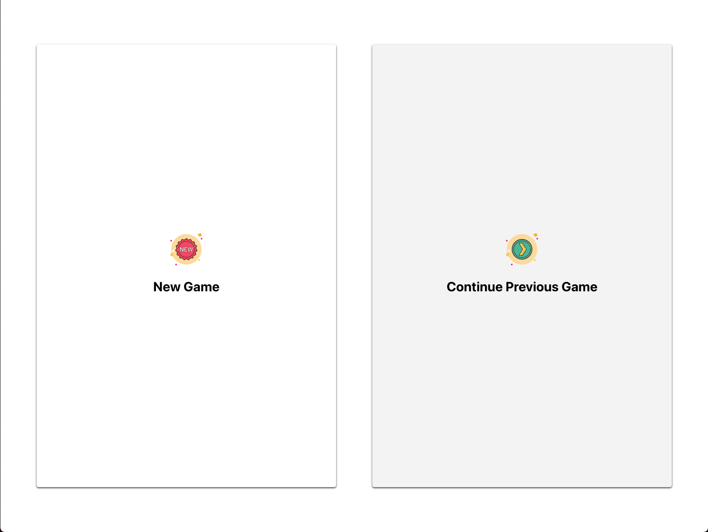

# Tic-Tac-Toe

This project was bootstrapped with [Create React App](https://github.com/facebook/create-react-app).

## The Tic-Tac-Toe App is deployed to Github Pages
[Play Here](https://albbrian.github.io/tic-tac-toe)

## Implementation Highlights
1. Game state is persisted if the web app is refreshed. The [Landing Page](https://albbrian.github.io/tic-tac-toe/landing) will provide option to resume previous game.

2. Confirmation box is prompt to confirm user, when starting a new game, remove the previous game state.

3. PVP (Player vs Player) and PVC (Player vs Computer) mode is available. PVC mode is implemented using randomized moves.

4. Unit test are written with high coverage.
5. 
6. End to end testing is implemented using Cypress on following flow
   1. Play through a game in PVP mode
   2. Play through a game in PVP mode, refresh a page, visit the landing page and continue the game
   3. Play through a game in PVC mode
7. Setup CI/CD on github actions to run unit tests, e2e tests, and deploy the app to github
pages [Here](https://albbrian.github.io/tic-tac-toe)